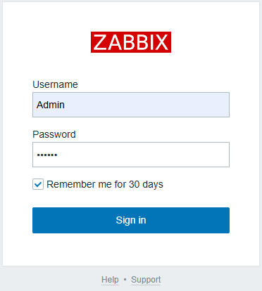

# Installing and Configuring Zabbix on Ubuntu 22.04
  ##  1.   To install Zabbix on Ubuntu 22.04, I am using the following dependencies:
        1. ubunto 22.04 jammy
        2. Server, Frontend, Agent
        3. mysql
        4. nginx
 ## 2. Install Zabbix Server, Frontend, and Agent:  
  + Start new shell session with root privileges. <br /> 
  ```sudo -s ```    
 + Install Zabbix repository. <br /> 
 ```bash
   wget https://repo.zabbix.com/zabbix/7.0/ubuntu/pool/main/z/zabbix-release/zabbix-release_latest+ubuntu22.04_all.deb
   dpkg -i zabbix-release_latest+ubuntu22.04_all.deb
   apt update
 ```
    
+ Install Zabbix server, frontend, agent. 
```bash
   apt install zabbix-server-mysql zabbix-frontend-php zabbix-nginx-conf zabbix-sql-scripts zabbix-agent
```    
## 3. Install MySQL Server And  Create the Zabbix Database And User :  
+  Install MySQL Server And Secure MySQL installation:
```bash
    sudo apt install mysql-server -y 
    sudo mysql_secure_installation 
```
+ Log in to MySQL.
```bash
   sudo mysql -u root -p
```
+ Create the Zabbix database and user.
```bash
   create database zabbix character set utf8mb4 collate utf8mb4_bin;
   create user zabbix@localhost identified by 'password';
   grant all privileges on zabbix.* to zabbix@localhost;
   set global log_bin_trust_function_creators = 1;
   quit;
```  
## 4. Configure MySQL for Zabbix: 
+ Import the initial schema and data.  
```bash 
  sudo zcat /usr/share/doc/zabbix-server-mysql*/create.sql.gz | mysql -u zabbix -p zabbix
```
+ Disable log_bin_trust_function_creators option after importing database schema.
```bash sudo mysql -u root -p;
   set global log_bin_trust_function_creators = 0;
   quit;
```
+ Edit Zabbix server configuration:
```bash
   sudo vim /etc/zabbix/zabbix_server.conf
```
+ Set the following values: <br /> 
    ```DBPassword=password```
## 5. Configure PHP for Zabbix frontend: 
+ Edit file /etc/zabbix/nginx.conf uncomment and set 'listen' and 'server_name' directives
  <br/> 
   ```sudo vim Edit file /etc/zabbix/nginx.conf```
+ And Set Below Configuration:
```bash
  listen 80
  server_name your_server_ip
```
## 6.  Start Zabbix server and agent processes: 
+ Start Zabbix server and agent processes and make it start at system boot.
    
```bash 
   systemctl restart zabbix-server zabbix-agent nginx php8.1-fpm
   systemctl enable zabbix-server zabbix-agent nginx php8.1-fpm
```
## 7. open Zabbix UI web page

 <br/>


# Installing and Configuring Zabbix on Ubuntu 22.04
## 1. Install Zabbix Agent on Client Machines
+ Start new shell session with root privileges. <br /> 
`sudo -s`
+ Install Zabbix repository.
```bash
  wget https://repo.zabbix.com/zabbix/7.0/ubuntu/pool/main/z/zabbix-release/zabbix-release_latest+ubuntu22.04_all.deb
  dpkg -i zabbix-release_latest+ubuntu22.04_all.deb
```
## 2. Configure Zabbix Agent
+ Edit the configuration file:<br/>
```bash
  sudo vim  /etc/zabbix/zabbix_agentd.conf
```
+ And Set
```bash
   Server=<Zabbix_Server_IP>
   ServerActive=<Zabbix_Server_IP>
   Hostname=<Client_Hostname>
```
+ Start and Enable Zabbix Agent
```bash
  sudo systemctl restart zabbix-agent
  sudo systemctl enable zabbix-agent
```
+ Allow Port on Client Firewall
```bash
  sudo ufw allow 10050/tcp
  sudo ufw reload
```
## 3. Add Client Machines to Zabbix Server
  1. Go to the Zabbix web interface.
  2. Navigate to Configuration > Hosts > Create Host.
  3. Enter the hostname, IP address, and select the group.
  4. Under Templates, choose a template to monitor (e.g., Template OS Linux).
  5. Click Add.


 

   
    
   
 
   


