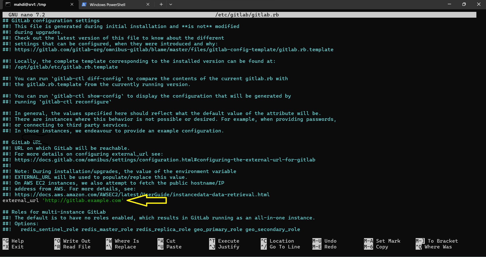
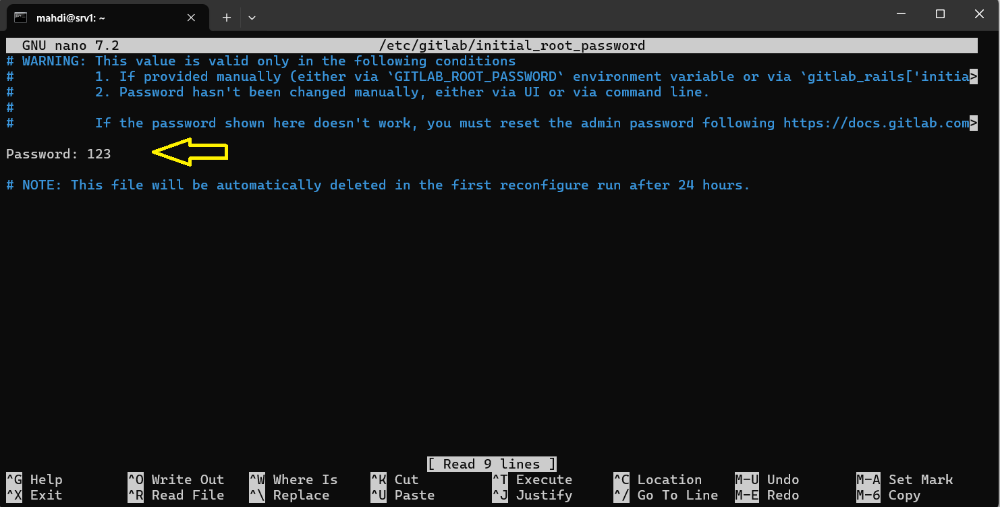
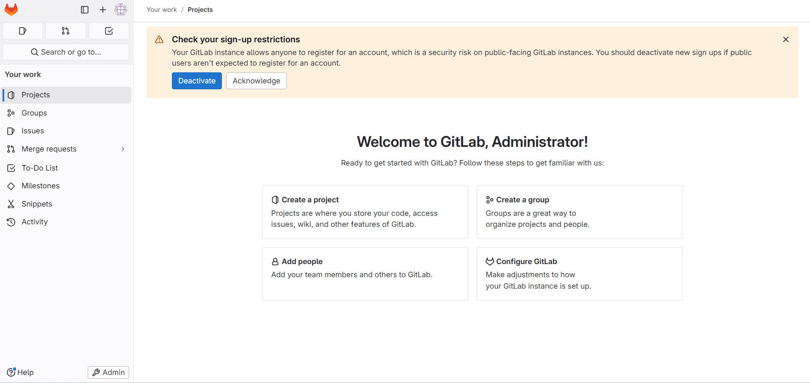

## Steps for implementing GitLab on Ubuntu
- **Step 1 — Update the Ubuntu system**
    ```bash
    sudo apt update
    sudo apt upgrade
    ```
- **Step 2 — Install required dependencies**
    ```bash
    sudo apt install ca-certificates curl openssh-server postfix tzdata perl
    ```
- **Step 3 — Add GitLab repository**
    ```bash
    cd /tmp
    curl -LO https://packages.gitlab.com/install/repositories/gitlab/gitlab-ce/script.deb.sh
    sudo bash /tmp/script.deb.sh
    ```
- **Step 4 — Install GitLab**
    ```bash
    sudo apt install gitlab-ce
    ```

    > *** I couldn't install it with this method due to internet speed issues, so I had to download GitLab locally, then transfer it to the main server and install it using blow bash:
    ```bash
    sudo dpkg -i gitlab-ce_17.5.1-ce.0_amd64.deb
    ```


- **Step 5 — Adjusting the Firewall Rules**
  - View the current status of your active firewall by running:
      ```bash
     sudo ufw status
      ```
  - you should allow that traffic:
     ```bash
     sudo ufw allow http
      sudo ufw allow https
     sudo ufw allow OpenSSH
      ```
- **Step 6 — Editing the GitLab Configuration File**
    ```bash
    sudo nano /etc/gitlab/gitlab.rb
    ```
 - **Step 7 — Editing the GitLab Configuration File**
    #### After installation, you'll need to configure GitLab. This includes setting the external URL that will be used to access GitLab. Open the  configuration file:
    ```bash
    sudo nano /etc/gitlab/gitlab.rb
    ```  
    #### Add the following code at the top (or anywhere in the file, just make sure it's not inside another configuration block):
    ```bash
    external_url 'https://yourdomain.com'  # Replace with your actual domain or IP
    ``` 
    
- **Step 8 — Reconfigure GitLab**
    ```bash
    sudo gitlab-ctl reconfigure
    ```
- **Step 9 —  Performing Initial Configuration Through the Web Interface
    
    - GitLab generates an initial secure password for you. It is stored in a folder that you can access as an administrative sudo user:
        ```bash
        sudo nano /etc/gitlab/initial_root_password
        ```
        
- **Step 10 — GitLab Environment Ss Ready**
   