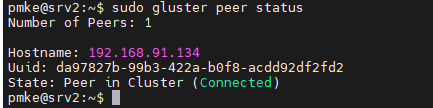

 ## Install GlusterFS on Ubuntu 22.04 LTS Jammy Jellyfish
 1. make sure that all your system packages are up-to-date by running the following apt commands in the terminal:
  ```bash
    sudo apt update
    sudo apt upgrade
  ```
  2. Installing GlusterFS on Ubuntu 22.04.:  
   +  To get the latest GlusterFS packages, add the official repository:
 ```bash
    sudo add-apt-repository ppa:gluster/glusterfs-9
  ```    
  + Update the package list and install GlusterFS server components:
 ```bash
    sudo apt update
    sudo apt install glusterfs-server
  ```
   + Now, start and enable the GlusterFS server to ensure it starts automatically on boot:  
 ```bash
    sudo systemctl start glusterd
    sudo systemctl enable glusterd
 ```  
 3. Creating a Trusted Storage Pool:
 + On one of the nodes, probe the other nodes to add them to the cluster:
 ```bash
     sudo gluster peer probe 192.168.91.134
     .
     .
 ```  
 

+ Create a trusted pool by executing this command on one of the nodes:
 ```bash
   sudo gluster pool list
```
+ Confirm the trusted pool’s status to ensure all nodes are :
 ```bash
   sudo gluster pool status
```
4. Create a GlusterFS Volume:
+ Now you can create a GlusterFS volume. Suppose you want to create a volume named gv0 using directories /data/brick1 and /data/brick2 on two nodes. You need to first create these directories:
 ```bash
  sudo mkdir -p /data/brick1
  sudo mkdir -p /data/brick2
```
+ Then create the volume:
 ```bash
  sudo gluster volume create myvolume replica 2 transport tcp 192.168.91.133:/data/brick1 192.168.91.134:/data/brick2 force
```
+ Start the volume and check its status:
 ```bash
  sudo gluster volume start myvolume
  sudo gluster volume info myvolume
  sudo gluster volume status myvolume
```


5. Mounting GlusterFS on Clients.
 + To mount the GlusterFS volume on client machines, install the GlusterFS client package:
 ```bash
  sudo apt install glusterfs-client
 ```
+ Create a directory where you want to mount the GlusterFS volume on your client machine:
 ```bash
   sudo mkdir /mnt/myvolume
 ```
 + Mount the GlusterFS volume using the mount command:
 ```bash
   sudo mount -t glusterfs 192.168.91.133:/myvolume /mnt/myvolume
 ```
+ Check if the volume is successfully mounted:
 ```bash
   df -h
 ```


