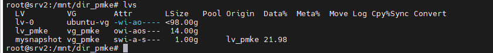
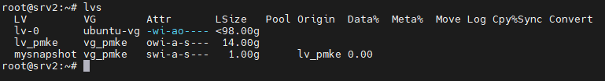
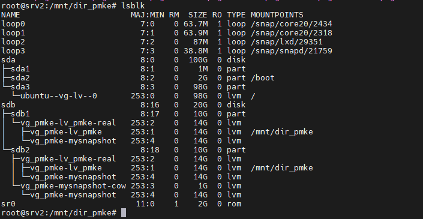
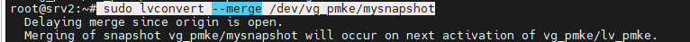
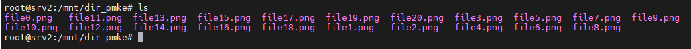

# LVM Snapshots Backup and Restore on Ubunto 
  ##  1.Identify the Volume Group and Logical Volume.
+ Run the following command to list the available volume groups and logical volumes:
  ```bash
  lvs
  ``` 
   <br />

## 2. Create a Test File Before Snapshot:
+ Assuming the logical volume is mounted (e.g., at /mnt/dir_pmke):
```bash
  mkdir -p /mnt/dir_pmke
  cd /mnt/dir_pmke   
  sudo touch file{0..20}.png
```
 
## 3. Creating LVM Snapshots using lvcreate :  
+  Identify the volume group and logical volume, then create a snapshot.
```bash
  sudo lvcreate --size 1G --snapshot --name mysnapshot /dev/vg_pmke/lv_pmke
```
 

## 4.Remove the Test Files
```bash
  cd /mnt/dir_pmke   
  rm -fr *
  ls -l
```
+ You can immediately verify that the mounting operating is effective by running the “lsblk” command again.
```bash
 lsblk
```
 

## 4. Restore the Snapshot: 
+ Restore the logical volume to its state at the time of the snapshot:
```bash
 sudo lvconvert --merge /dev/vg_pmke/mysnapshot
 sudo umount /mnt/dir_pmke
```
 
+ Reactivate the logical volume
 ```bash
 sudo lvchange -a n /dev/vg_pmke/lv_pmke
 sudo lvchange -a y /dev/vg_pmke/lv_pmke
```
+ For the last step, mount again your logical volume “volume1” and confirm that all of the deleted data has been recovered.
```bash
sudo mount /dev/vg_pmke/lv_pmke /mnt/dir_pmke
 du -s /mnt/dir_pmke
```
+ Navigate back to the mount point and check files
 


